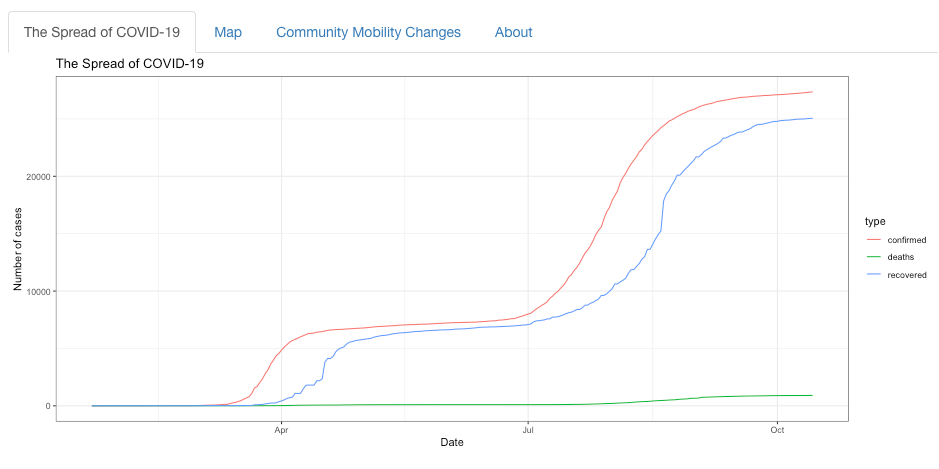
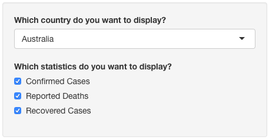
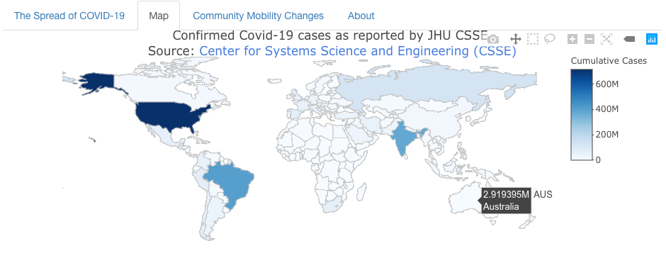

```{r, include = FALSE}
knitr::opts_chunk$set(
  collapse = TRUE,
  echo = FALSE,
  message = FALSE,
  warning = FALSE,
  comment = "#>"
)
```

## Installation

You can install the released version of covidtrack from [CRAN](https://CRAN.R-project.org) with:

``` r
install.packages("covidtrack")
```

And the development version from [GitHub](https://github.com/etc5523-2020/r-package-assessment-yezihe-0063) with:

``` r
# install.packages("devtools")
devtools::install_github("etc5523-2020/r-package-assessment-yezihe-0063")
```
## Example

This is a basic example which shows you how to solve a common problem:

```{r example}
library(covidtrack)
## basic example code
```

## Launching Shiny Dashboard
The applicaiton can be launched by using the following line of code:

```{r launch, eval=FALSE}
launch_app()
```

## Data Resources

The raw data pulled from the Johns Hopkins University Center for Systems Science and Engineering (JHU CCSE) Coronavirus [repository](https://github.com/CSSEGISandData/COVID-19).Community Mobility Changes data comes from [Google](https://www.google.com/covid19/mobility/)


### The Spread of COVID-19

The **The Spread of COVID-19** collects coronavirus cases from all countries in the world, including confirmed cases, reported deaths and recovered cases.The raw data pulled from the Johns Hopkins University Center for Systems Science and Engineering (JHU CCSE) Coronavirus [repository](https://github.com/CSSEGISandData/COVID-19).


You can filter the countries you want to observe through the selection bar on the left, as well as the statistics.



### Map

The **Map** section provides a world map. By moving the mouse to the country, it will show you the country name and the cumulative number of confirmed cases so far. Due to the large amount of data, this may take a while.



### Community Mobility Changes

**Community Mobility Changes** shows movement trends across different categories of places, and you can also filter countries through the options on the left. Community Mobility Changes data comes from [Google](https://www.google.com/covid19/mobility/) (some countries may have missing data).


